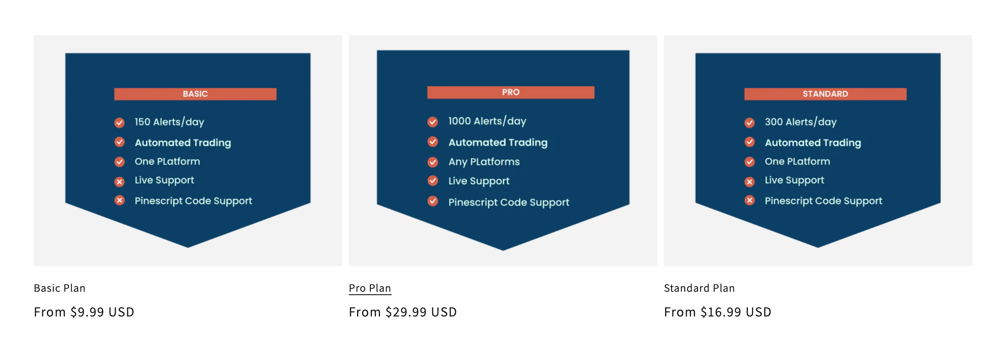
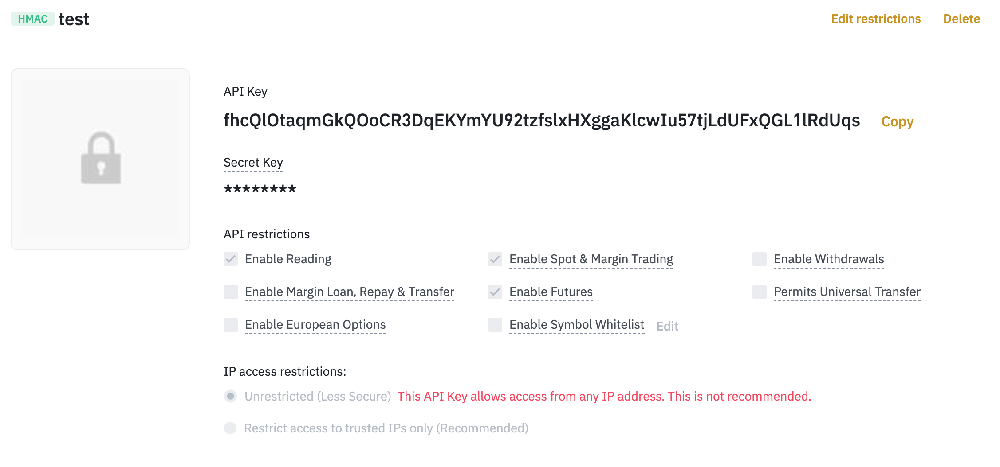
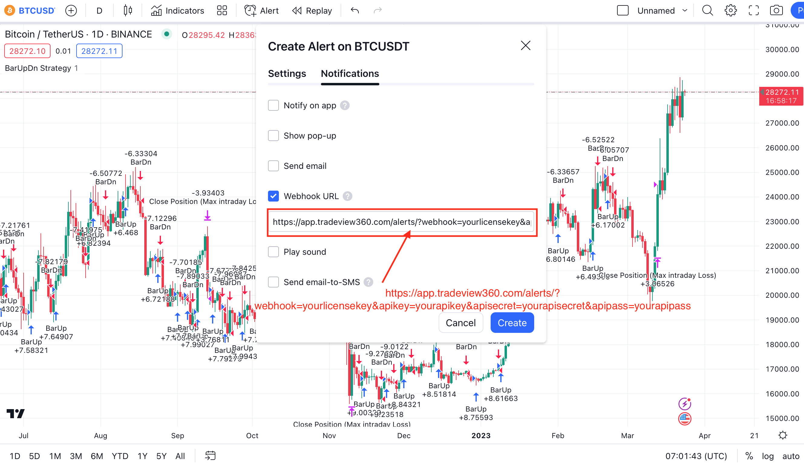
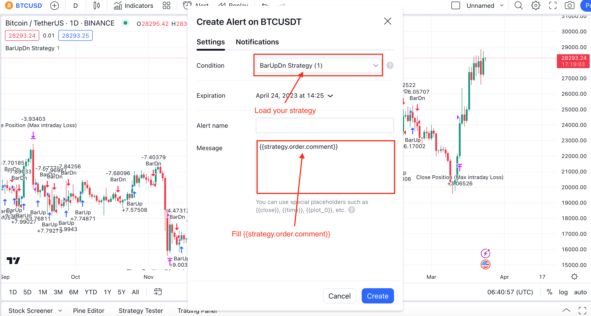

# QUICK START

## -Get a license key from Tradeview360.com

You will get your license after checkout.
## -Create a apikey from your platform

***We do not store your API keys. They are sent directly to the platform, ensuring that your data is not leaked***
According to your requirements for enabling trading and reading features.
## -Config alert in Tradingview.com

```
https://app.tradeview360.com/alerts/?webhook=yourlicensekey&apikey=yourapikey&apisecret=yourapisecret&apipass=yourapipass
```
Replace your API information with this link.

```
Tips
"apipass" is an option for some platforms. If you don't have one, you can leave it blank.
```


Your trading signals will be sent to us through comment.
```pinescript
strategy.entry(title, side, qty, when=condition, comment=your commands are here)
```

Examples
```pinescript
strategy.entry(title, side, qty, when=condition, comment=ACTION=BUY SYMBOL=BTCUSDT QTY=10 ACCOUNT=USDM)
strategy.exit(title, side, qty, when=condition, comment=ACTION=CLOSE SYMBOL=BTCUSDT QTY=10 ACCOUNT=USDM)
```
<br/>
<br/>
<br/>

# BINANCE
## -Check balance example
```
ACTION=BALANCE SYMBOL=USDT ACCOUNT=SPOT
```
| Command | Required | Tips  |
| :----   | :----    | :---- |
| `ACTION` | *true* | `BALANCE`|
| `SYMBOL` | *true* | |
| `ACCOUNT` | *true* | `SPOT`, `USDM`, `COINM` | 

## -Create an order example

```
ACTION=BUY SYMBOL=BTCUSDT QTY=10 ACCOUNT=USDM
```
| Command | Required | Tips  |
| :----   | :----    | :---- |
| `ACTION` | *true* | `BUY`, `SELL`|
| `SYMBOL` | *true* | |
| `ACCOUNT` | *true* | `SPOT`, `USDM`, `COINM` |
| `QTY` | *true* | *Only accept numeric* |  

## -Close an order example

```
ACTION=CLOSE SYMBOL=BTCUSDT ACCOUNT=USDM QTY=100%
```
| Command | Required | Tips  |
| :----   | :----    | :---- |
| `ACTION` | *true* | `BALANCE`|
| `SYMBOL` | *true* | |
| `ACCOUNT` | *true* | `SPOT`, `USDM`, `COINM` |
| `QTY`| false | Accpet percentage and numeric |
## -Cancel orders example

Cancel open orders by symbol
```
ACTION=CANCEL SYMBOL=BTCUSDT ACCOUNT=USDM
```
| Command | Required | Tips  |
| :----   | :----    | :---- |
| `ACTION` | *true* | `CANCEL`|
| `SYMBOL` | *true* | |
| `ACCOUNT` | *true* | `SPOT`, `USDM`, `COINM` |

## -Commands and parameters

| Command | Type   | Parameters |
|  :----  | :----  | :---- |
| `ACTION`  | {parameters} | `BALANCE`, `BUY`, `SELL`, `CANCEL`, `CLOSE` |
| `ACCOUNT` | {parameters} | `SPOT`, `LINEAR`, `INVERSE` |
| `SYMBOL`  | {symbols} | example: `BTC`, `USDT`, `DOGEUSDT`  |
| `QTY`     | {percentage or numeric} | example: `100`, `50%` | 

<br/>
<br/>
<br/>

# BYBIT

## -Check balance example
```
ACTION=BALANCE SYMBOL=USDT ACCOUNT=SPOT
```
| Command | Required | Tips  |
| :----   | :----    | :---- |
| `ACTION` | *true* | `BALANCE`|
| `SYMBOL` | *true* | |
| `ACCOUNT` | *true* | `SPOT`, `LINEAR`, `INVERSE` | 

## -Create an order example

```
ACTION=BUY SYMBOL=BTCUSDT QTY=10 ACCOUNT=LINEAR
```
| Command | Required | Tips  |
| :----   | :----    | :---- |
| `ACTION` | *true* | `BUY`, `SELL`|
| `SYMBOL` | *true* | |
| `ACCOUNT` | *true* | `SPOT`, `LINEAR`, `INVERSE` |
| `QTY` | *true* | *Only accept numeric* |  

## -Close an order example

```
ACTION=CLOSE SYMBOL=BTCUSDT ACCOUNT=LINEAR QTY=100%
```
| Command | Required | Tips  |
| :----   | :----    | :---- |
| `ACTION` | *true* | `BALANCE`|
| `SYMBOL` | *true* | |
| `ACCOUNT` | *true* | `SPOT`, `LINEAR`, `INVERSE` |
| `QTY`| false | Accpet percentage and numeric |

## -Cancel orders example

Cancel open orders by symbol
```
ACTION=CANCEL SYMBOL=BTCUSDT ACCOUNT=LINEAR
```
| Command | Required | Tips  |
| :----   | :----    | :---- |
| `ACTION` | *true* | `CANCEL`|
| `SYMBOL` | *true* | |
| `ACCOUNT` | *true* | `SPOT`, `LINEAR`, `INVERSE` |

## -Commands and parameters

| Command | Type   | Parameters |
|  :----  | :----  | :---- |
| `ACTION`  | {parameters} | `BALANCE`, `BUY`, `SELL`, `CANCEL`, `CLOSE` |
| `ACCOUNT` | {parameters} | `SPOT`, `LINEAR`, `INVERSE` |
| `SYMBOL`  | {symbols} | example: `BTC`, `USDT`, `DOGEUSDT`  |
| `QTY`     | {percentage or numeric} | example: `100`, `50%` | 